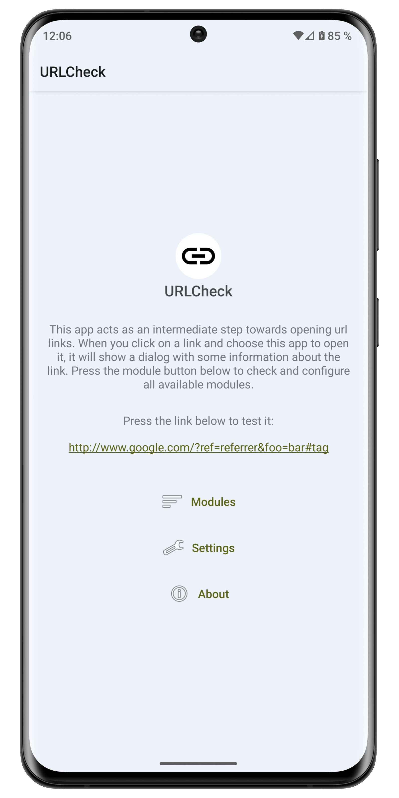
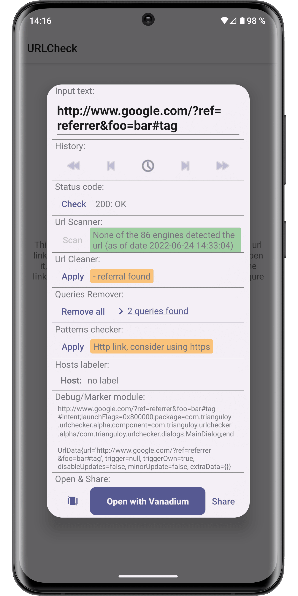
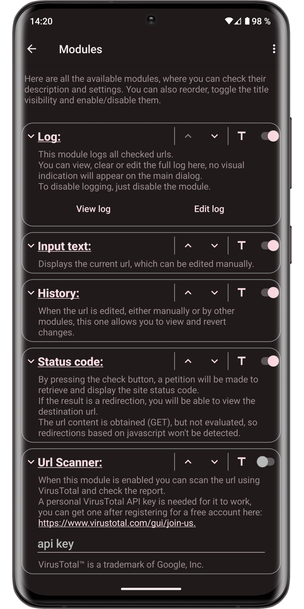
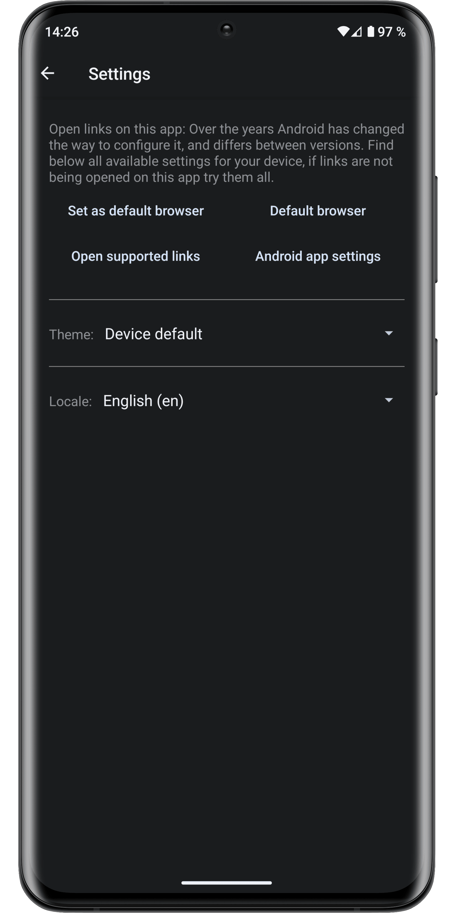

<div align="center">

<!-- Header Banner -->


# URL Shield

**Protect your privacy, remove trackers, and analyze links before opening them.**

[](https://www.android.com)
[](https://creativecommons.org/licenses/by/4.0/)
[](https://developer.android.com/about/versions/nougat)
[](https://developer.android.com/about/versions/16)

---

</div>

## 📌 Overview

**URL Shield** acts as a powerful, customizable intermediary when opening URL links on Android. Whenever you tap a link in an email, messaging app, or browser, URL Shield opens an interactive window displaying comprehensive information about the URL, allowing you to review, clean, and modify it before proceeding.

- 🛑 **Remove Tracking & Affiliates:** Automatically strip out referral codes, tracking parameters, and unnecessary query keys.
- 🛡️ **Anti-Phishing & Fraud Detection:** Inspect non-ASCII characters (homograph attacks) and verify domain host safety.
- 🔍 **Safety & Threat Scanning:** Remotely scan URLs via VirusTotal and unshorten obfuscated links.
- ⚡ **Lightweight & Privacy-First:** Free, open-source, no ads, no trackers, and requires minimal permissions.

---

## 📸 Screenshots

<div align="center">
  
  
  
  
</div>

---

## ⚙️ Modules & Features

URL Shield features a fully modular setup. You can enable, disable, and reorder modules according to your needs:

| Module | Description |
| :--- | :--- |
| **Input Text** | Displays the current URL with full inline editing capability. *(Required)* |
| **URL Cleaner** | Uses the [ClearURLs catalog](https://docs.clearurls.xyz/) to eliminate referral codes, tracking tokens, and perform offline redirections. |
| **Queries Remover** | Decodes individual URL query parameters, allowing you to selectively view or delete keys. |
| **Hosts Checker** | Labels hosts using local rules or remote host lists like [StevenBlack/hosts](https://github.com/StevenBlack/hosts) (blocking adware, malware, fake news, gambling, etc.). |
| **Pattern Module** | Matches URLs against customizable Regex patterns to warn about risks (e.g., non-ASCII phishing/homograph attacks) or suggest privacy alternatives (e.g., Invidious, Nitter). |
| **Unshortener** | Expands shortened URLs remotely via [unshorten.me](https://unshorten.me/). |
| **URL Scanner** | Integrates with [VirusTotal™](https://www.virustotal.com/) API to perform multi-engine security scans. *(Personal API key required)* |
| **Status Code** | Sends a network request to check HTTP response status codes (200, 301, 404, 500, etc.) and inspect HTTP redirection headers. |
| **History** | Revert edits and changes made by modules or manual input (Undo/Redo). |
| **Log** | Stores a local log of checked URLs for quick review, copying, or clearing. |
| **Open Module** | Provides quick target app choice and sharing options. *(Required)* |
| **Debug Module** | Displays Intent URI details and Custom Tabs service information (for developers). |

---

## 🔒 Privacy & Security

- **Zero Advertising & Tracking:** Completely free of ads, analytics, or background data collection.
- **Minimal Permissions:** Uses only the `INTERNET` permission for user-initiated network requests (e.g., VirusTotal scans, Unshortener, Status Code checks).
- **Offline Processing:** URL cleaning, query removal, pattern matching, and host checking are performed entirely on-device.

---

## 🚀 Building & Installation

### Requirements
- Android 7.0 (API Level 24) or higher
- Android Studio Ladybug (or newer)
- JDK 17

### Build from Source

1. **Clone the repository:**
   ```bash
   git clone https://github.com/amitskr/URL-Shield.git
   cd URL-Shield
   ```

2. **Build the APK using Gradle CLI:**
   ```bash
   ./gradlew assembleDebug
   ```
   The output APK will be generated at:
   `app/build/outputs/apk/debug/app-debug.apk`

3. **Install on a connected Android device:**
   ```bash
   ./gradlew installDebug
   ```

---

## 🤝 Contributing

Contributions are warmly welcome! Whether you are a developer fixing bugs, adding new modules, or a translator helping localize the app:

- Read our [Contributing Guidelines](docs/CONTRIBUTING.md) for details on code style, translations, and submitting Pull Requests.
- Help translate URL Shield via [Weblate](https://hosted.weblate.org/engage/urlcheck/) or by editing [`strings.xml`](app/src/main/res/values/strings.xml).

---

## 📜 License & Acknowledgments

- **License:** Open Source under the [Creative Commons Attribution 4.0 International License (CC BY 4.0)](LICENSE).
- **ClearURLs Rules:** Rules catalog provided by [ClearURLs](https://docs.clearurls.xyz/).
- **Hosts Database:** Blocklists powered by [StevenBlack/hosts](https://github.com/StevenBlack/hosts).
- **Unshortener Engine:** Powered by [unshorten.me](https://unshorten.me/).
